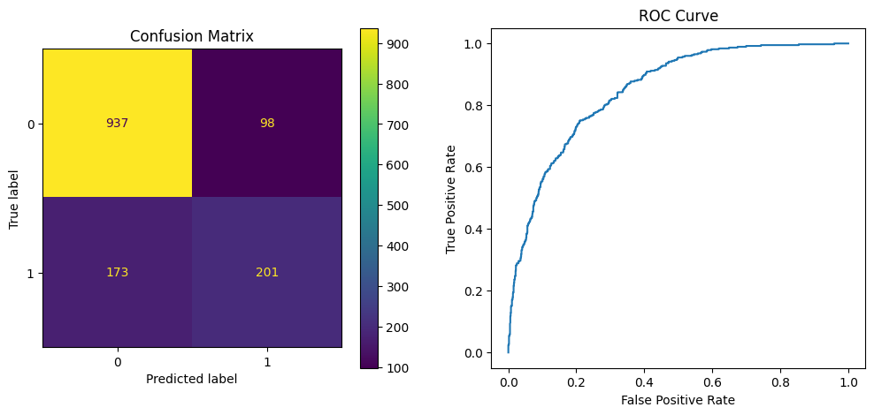

# Churn Prediction Model

Build a binary classification model to predict whether a customer will churn (i.e., discontinue their subscription) or not based on various features in the dataset. You are given a dataset containing customer information and whether they churned or not in the past. Your task is to use this dataset to train a machine learning model and evaluate its performance on a test set.

## Getting Started

## Installation

Clone the repository and install the required packages using pip:

```
git clone https://github.com/mohammadrezashariat/Rayankar
cd Rayankar
pip install -r requirements.txt
```

## Usage

To run the prediction model, execute the following command in the project root directory:

```
python main.py
```

This will preprocess the data, train the model, and generate predictions for the test set. The model accuracy will be printed to the console.

## Dataset

You can use the Telco Customer Churn dataset, which is available on Kaggle at https://www.kaggle.com/blastchar/telco-customer-churn.

## Model

The prediction model is a logistic regression classifier, trained using scikit-learn.

### Data Preprocessing

The dataset was preprocessed using the following steps:

#### Remove duplicate rows

There were no duplicate rows in the dataset, so no rows were removed.

#### Remove unnecessary columns

The "customerID" column was removed as it does not contribute to predicting customer churn.

#### Handle missing values

There were missing values in 'TotalCharges' the dataset, so fill with mean of 'TotalCharges'.

#### Convert categorical variables to numerical

Categorical variables such as :

```
['gender', 'InternetService', 'PaymentMethod', 'Partner', 'Dependents', 'PhoneService', 'PaperlessBilling', 'MultipleLines', 'OnlineSecurity', 'OnlineBackup', 'DeviceProtection', 'TechSupport', 'StreamingTV', 'StreamingMovies', 'Contract', 'PaperlessBilling']
```

were converted to numerical using one-hot encoding.

#### Scale numerical variables

The numerical variables "MonthlyCharges", and "TotalCharges" were scaled using np.log1p.

#### Feature Selection/Engineering

The features used for training the model were selected based on their relevance in predicting customer churn. The selected features were

```
["gender", "SeniorCitizen", "Partner", "Dependents", "tenure", "PhoneService", "MultipleLines", "InternetService", "OnlineSecurity", "OnlineBackup", "DeviceProtection", "TechSupport", "StreamingTV", "StreamingMovies", "Contract", "MonthlyCharges",
"TotalCharges"]
```
No additional feature engineering was performed.

#### Choice of Algorithm

_'Logistic regression'_ was chosen as the algorithm for this problem because it is a simple yet effective algorithm for binary classification problems such as predicting customer churn.

#### Evaluation Metrics

The model was evaluated using the following metrics:

_Accuracy_: The proportion of correct predictions made by the model.

_ROC Curve_: A plot of the true positive rate (TPR) against the false positive rate (FPR) for different classification thresholds.

_Confusion Matrix_: A matrix showing the number of true positives, true negatives, false positives, and false negatives predicted by the model.

## model's performance


